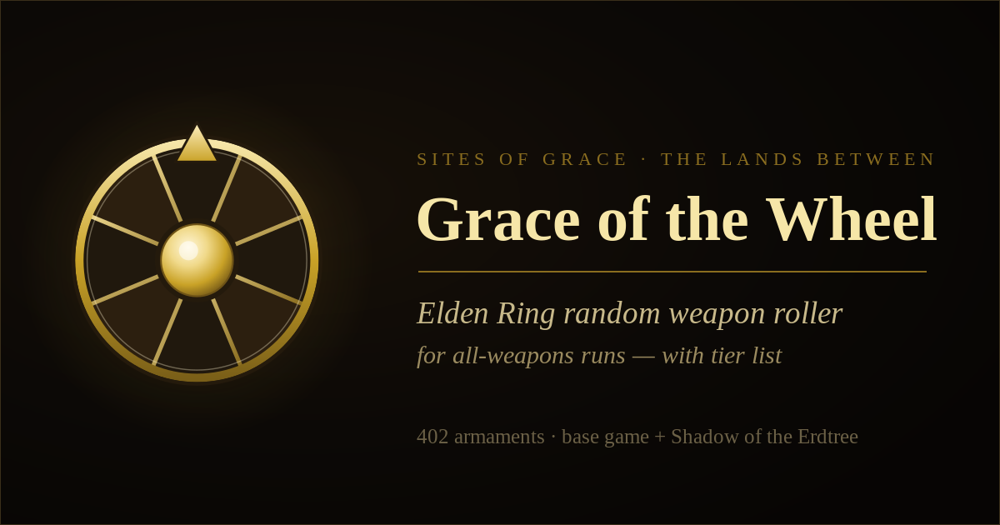

<div align="center">



# Grace of the Wheel

**A companion for Elden Ring all-weapons runs.** Spin the wheel for a random
armament, retire each weapon as you clear it, and rank your journey on a
drag-and-drop tier list.

[**▶ Live site**](https://villusion.github.io/er-weapon-wheel/) · [Buy me a coffee ☕](https://buymeacoffee.com/gomatic)

</div>

---

## What it does

An all-weapons run means beating the game using every weapon at least once.
This tool keeps track of that run:

- **Random weapon roller** — a spinning wheel picks your next armament from
  whichever weapon categories you choose.
- **Roll from one or more categories** — tick as many as you like; the wheel
  draws from the combined pool.
- **Group quick-filters** — one-click toggles for **Melee**, **Ranged**,
  **Catalysts**, **Shields**, and **DLC** (include/exclude Shadow of the
  Erdtree weapons).
- **Retire weapons as you clear them** — a retired weapon leaves the wheel, so
  you never roll a duplicate. Restore it anytime.
- **Tier list** — drag your used weapons into an **S / A / B / C / D / F**
  board to rank them as you go.
- **Progress tracking** — see how many of the 402 weapons you have left.
- **Saves automatically** — your run lives in the browser (localStorage), with
  **Export / Import** JSON backups and a reset.

Covers all **402 weapons** from the base game and *Shadow of the Erdtree*,
grouped into the game's 40 weapon types.

## Usage

No install, no build, no dependencies — it's a single HTML file.

- **Online:** open the [live site](https://villusion.github.io/er-weapon-wheel/).
- **Offline:** download `index.html` and open it in any modern browser. Keep
  the `wheel-*.png` files next to it if you want the favicon and social preview
  image to work.

## Adding or editing weapons

All weapon data lives in one `WEAPONS` object near the top of the `<script>`
block in `index.html`. Each category is just a list of names:

```js
const WEAPONS = {
  "Daggers": ["Black Knife", "Blade of Calling", "Dagger", /* … */],
  "Straight Swords": [ /* … */ ],
  // …
};
```

Add, remove, or rename entries and the wheel, category list, filters, and
counts all rebuild automatically. It's a good spot to drop in Convergence mod
weapons or a custom challenge list. The included
`Elden Ring Weapons List - Weapons.csv` is the source the default roster was
built from.

## How it works

Everything runs client-side in a single file:

- The wheel is drawn on a `<canvas>` and spins clockwise a random number of
  full rotations before landing on the winner.
- State (retired weapons, tier placements, selected categories, DLC toggle) is
  persisted to `localStorage` under the key `er-allweapons-v1`.
- The favicon and share banner are the golden-wheel emblem
  (`wheel-icon.svg` → `wheel-*.png`, `wheel-og.png`).

## Deploying

This site is published to **GitHub Pages** at
`https://villusion.github.io/er-weapon-wheel/` via GitHub Actions. In the repo,
set **Settings → Pages → Source → GitHub Actions** once. After that, every push
to `main` runs `.github/workflows/deploy.yml`, which uploads the repository and
deploys it — no branch build needed. You can also trigger it manually from the
**Actions** tab.

Supporting files included for Pages:

- `.github/workflows/deploy.yml` — the GitHub Actions deploy workflow
- `.nojekyll` — serve files as-is (skip the Jekyll build step)
- `robots.txt` — allow crawlers and point to the sitemap
- `sitemap.xml` — the canonical URL for search engines
- `404.html` — a themed not-found page

If you host it elsewhere, update the canonical, `og:url`, `og:image`, and
`twitter:image` URLs in the `<head>` of `index.html`, plus `robots.txt` and
`sitemap.xml`.

## Support

If this helped your run, you can [buy me a coffee ☕](https://buymeacoffee.com/gomatic).
Feature ideas are welcome via the in-app "Request a feature" button.

## License

[MIT](#license) © 2026 villusion. Free to copy, modify, and reuse — please keep
the donate button intact if you publish a copy. Full license text is in the
comment at the top of `index.html`.

> *Elden Ring* and all related names are trademarks of FromSoftware / Bandai
> Namco. This is an unofficial fan-made tool with no affiliation.
